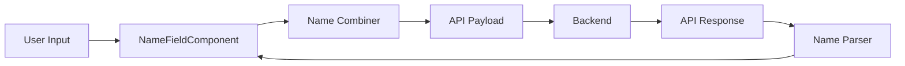

# Design Document: Name Field Split Feature

## Overview

This feature transforms the single full name input field into a structured three-field component (Title, First Name, Last Name) across all forms in the application. The design maintains backward compatibility with the existing API that expects a single "name" string by implementing bidirectional conversion logic.

The solution follows Flutter's composition pattern, creating a reusable `NameFieldComponent` widget that encapsulates the three input fields and their conversion logic. This component will replace all existing full_name fields in Registration, Profile Update, and Matrimony Registration forms.

### Key Design Principles

- **API Compatibility**: All API contracts remain unchanged; conversion happens at the presentation layer
- **Reusability**: Single component used across all forms
- **Data Integrity**: Round-trip conversion preserves user input
- **Localization**: Full i18n support for all labels and validation messages

## Architecture

### Component Hierarchy

```
NameFieldComponent (Stateful Widget)
├── Title Dropdown (AppInputTextField with isDropdown=true)
├── First Name Field (AppInputTextField)
└── Last Name Field (AppInputTextField)
```

### Data Flow



### Integration Points

The component integrates with existing forms by:
1. Replacing `AppInputTextField` instances that use "full_name" label
2. Exposing a `getCombinedName()` method for form submission
3. Accepting an optional `initialName` parameter for edit mode
4. Using existing `FormValidator` for validation

## Components and Interfaces

### 1. NameFieldComponent Widget

**Purpose**: Reusable stateful widget that displays three name input fields and manages their state.

**Public Interface**:
```dart
class NameFieldComponent extends StatefulWidget {
  final String? initialName;
  final bool isRequired;
  final Function(String)? onChanged;
  
  const NameFieldComponent({
    Key? key,
    this.initialName,
    this.isRequired = true,
    this.onChanged,
  }) : super(key: key);
  
  @override
  State<NameFieldComponent> createState() => NameFieldComponentState();
}

class NameFieldComponentState extends State<NameFieldComponent> {
  String getCombinedName();
  bool validate();
}
```

**Internal State**:
- `titleCtrl`: TextEditingController for title dropdown
- `firstNameCtrl`: TextEditingController for first name
- `lastNameCtrl`: TextEditingController for last name
- `_formKey`: GlobalKey<FormState> for validation

**Behavior**:
- On initialization, if `initialName` is provided, parse it using `NameParser`
- On any field change, call `onChanged` callback with combined name
- Expose `getCombinedName()` for parent forms to retrieve the combined value
- Expose `validate()` to trigger form validation

### 2. NameCombiner Utility

**Purpose**: Static utility class that combines title, first name, and last name into a single string.

**Interface**:
```dart
class NameCombiner {
  static String combine({
    required String title,
    required String firstName,
    required String lastName,
  });
}
```

**Algorithm**:
1. Trim all input strings
2. Build list of non-empty components in order: [title, firstName, lastName]
3. Join with single space
4. Apply normalization: replace multiple consecutive spaces with single space
5. Return trimmed result

**Edge Cases**:
- Empty title: Format as "FirstName LastName"
- Empty lastName: Format as "Title FirstName" or "FirstName"
- All empty: Return empty string
- Extra spaces: Normalize to single spaces

### 3. NameParser Utility

**Purpose**: Static utility class that extracts title, first name, and last name from a combined name string.

**Interface**:
```dart
class NameParser {
  static const List<String> validTitles = ['Mr.', 'Mrs.', 'Ms.', 'Dr.', 'Prof.'];
  
  static NameComponents parse(String fullName);
}

class NameComponents {
  final String title;
  final String firstName;
  final String lastName;
  
  const NameComponents({
    required this.title,
    required this.firstName,
    required this.lastName,
  });
}
```

**Algorithm**:
1. Trim and normalize spaces in input string
2. Split by whitespace into words
3. Check if first word (with or without period) matches validTitles
4. If title found:
   - Extract title
   - Last word becomes lastName
   - All middle words become firstName
5. If no title:
   - Last word becomes lastName
   - All other words become firstName
6. Handle single-word names: assign to firstName, leave lastName empty

**Edge Cases**:
- Single word: firstName only
- Title with period vs without: "Mr." and "Mr" both recognized
- Multiple middle names: all included in firstName
- Extra spaces: normalized before processing

### 4. Form Integration

**Registration Form** (`register_page.dart`):
- Replace existing `AppInputTextField` with label "full_name"
- Use `GlobalKey<NameFieldComponentState>` to access combined name
- Call `nameFieldKey.currentState?.getCombinedName()` in form submission

**Profile Update Form** (`update_profile_page.dart`):
- Replace `fullNameCtrl` TextField with `NameFieldComponent`
- Pass `initialName: user.name` for pre-population
- Update `updateProfile()` to use combined name

**Matrimony Registration** (`reg_matrimony_page.dart`):
- Replace `nameCtrl` TextField with `NameFieldComponent`
- Update payload construction to use combined name

## Data Models

### NameComponents Model

```dart
class NameComponents {
  final String title;
  final String firstName;
  final String lastName;
  
  const NameComponents({
    required this.title,
    required this.firstName,
    required this.lastName,
  });
  
  bool get isEmpty => title.isEmpty && firstName.isEmpty && lastName.isEmpty;
  
  @override
  bool operator ==(Object other) =>
      identical(this, other) ||
      other is NameComponents &&
          runtimeType == other.runtimeType &&
          title == other.title &&
          firstName == other.firstName &&
          lastName == other.lastName;
  
  @override
  int get hashCode => title.hashCode ^ firstName.hashCode ^ lastName.hashCode;
}
```

### API Payload Structure

No changes to existing API payloads. The "name" field continues to be a single string:

```json
{
  "name": "Mr. John Doe",
  "email": "john@example.com",
  ...
}
```

## Correctness Properties


*A property is a characteristic or behavior that should hold true across all valid executions of a system—essentially, a formal statement about what the system should do. Properties serve as the bridge between human-readable specifications and machine-verifiable correctness guarantees.*

### Property 1: Name combiner concatenates with single spaces

*For any* title, first name, and last name strings, when combined by the NameCombiner, the result should contain each non-empty component separated by exactly one space.

**Validates: Requirements 2.1**

### Property 2: Name combiner normalizes whitespace

*For any* title, first name, and last name strings (including those with leading, trailing, or multiple consecutive spaces), the combined result should have all leading and trailing whitespace removed and all consecutive spaces replaced with single spaces.

**Validates: Requirements 2.5, 2.6**

### Property 3: Name parser extracts title when present

*For any* name string that starts with a valid title ("Mr.", "Mrs.", "Ms.", "Dr.", "Prof."), the parser should extract that title into the title component.

**Validates: Requirements 3.1**

### Property 4: Name parser extracts last word as last name

*For any* name string with multiple words, the parser should extract the last word as the last name component.

**Validates: Requirements 3.4**

### Property 5: Name parser extracts middle words as first name

*For any* name string, all words between the title (if present) and the last word should be extracted as the first name component.

**Validates: Requirements 3.5**

### Property 6: Name parser normalizes whitespace

*For any* name string (including those with extra spaces between words or around components), the parser should trim whitespace from each extracted component and normalize multiple spaces to single spaces.

**Validates: Requirements 4.4, 4.5**

### Property 7: Name parser handles title variations

*For any* valid title, the parser should recognize it both with and without a trailing period (e.g., "Mr." and "Mr" should both be recognized as the same title).

**Validates: Requirements 4.6**

### Property 8: Round-trip combine then parse preserves components

*For any* valid combination of title, first name, and last name, combining them and then parsing the result should produce equivalent component values (after normalization).

**Validates: Requirements 5.1**

### Property 9: Round-trip parse then combine preserves name

*For any* name string, parsing it into components and then combining those components should produce a string equivalent to the original after normalization.

**Validates: Requirements 5.2**

## Error Handling

### Validation Errors

**Empty First Name**:
- Trigger: User attempts to submit form with empty first name field
- Behavior: Display validation error message below first name field
- Message: Localized string from i18n (e.g., "First name is required")
- Prevention: Form submission blocked until corrected

**Invalid Characters**:
- Trigger: User enters numbers or special characters in name fields
- Behavior: Use existing `FormValidator.name` validation
- Message: Display appropriate validation error
- Prevention: Form submission blocked until corrected

### Parsing Errors

**Malformed Name String**:
- Trigger: API returns name with unexpected format
- Behavior: Best-effort parsing, populate available fields
- Fallback: If parsing completely fails, populate first name with entire string
- Logging: Log warning for debugging purposes

**Null or Empty API Response**:
- Trigger: API returns null or empty string for name
- Behavior: Leave all fields empty
- No error displayed: This is a valid state for new forms

### Component Errors

**Controller Disposal**:
- All TextEditingControllers must be properly disposed in component's dispose() method
- Prevents memory leaks in long-running app sessions

**State Management**:
- Component state must be properly initialized before first build
- Handle widget rebuild scenarios without losing user input

## Testing Strategy

### Unit Testing

Unit tests will focus on specific examples, edge cases, and error conditions:

**NameCombiner Tests**:
- Empty title with first and last name
- Empty last name with title and first name
- All fields empty
- Single word in each field
- Multiple words in first name field
- Whitespace edge cases (leading, trailing, multiple spaces)

**NameParser Tests**:
- Each valid title ("Mr.", "Mrs.", "Ms.", "Dr.", "Prof.")
- Titles with and without periods
- Single-word names
- Names without titles
- Names with multiple middle names
- Whitespace edge cases

**NameFieldComponent Tests**:
- Initial name parsing on component creation
- Validation with empty first name
- Validation with valid input
- getCombinedName() returns correct format

**Integration Tests**:
- Component integration in registration form
- Component integration in profile update form
- Component integration in matrimony form
- Form submission with combined name
- Edit mode with name pre-population

### Property-Based Testing

Property tests will verify universal properties across all inputs using the `flutter_test` framework with a property-based testing approach (minimum 100 iterations per test):

**Library**: We'll implement a simple property-based testing helper using Dart's `Random` class to generate test data, as Flutter doesn't have a mature PBT library like Haskell's QuickCheck.

**Test Configuration**:
- Minimum 100 iterations per property test
- Random generation of titles, names, and whitespace patterns
- Each test tagged with feature and property reference

**Property Test Cases**:

1. **Property 1: Name combiner concatenates with single spaces**
   - Generate: Random title (or empty), random first name, random last name
   - Verify: Non-empty components separated by single space
   - Tag: `Feature: name-field-split, Property 1: Name combiner concatenates with single spaces`

2. **Property 2: Name combiner normalizes whitespace**
   - Generate: Names with random leading/trailing/multiple spaces
   - Verify: Result has no leading/trailing spaces, single spaces between words
   - Tag: `Feature: name-field-split, Property 2: Name combiner normalizes whitespace`

3. **Property 3: Name parser extracts title when present**
   - Generate: Names starting with random valid titles
   - Verify: Title correctly extracted
   - Tag: `Feature: name-field-split, Property 3: Name parser extracts title when present`

4. **Property 4: Name parser extracts last word as last name**
   - Generate: Names with random number of words (2+)
   - Verify: Last word extracted as last name
   - Tag: `Feature: name-field-split, Property 4: Name parser extracts last word as last name`

5. **Property 5: Name parser extracts middle words as first name**
   - Generate: Names with varying numbers of middle words
   - Verify: All middle words in first name
   - Tag: `Feature: name-field-split, Property 5: Name parser extracts middle words as first name`

6. **Property 6: Name parser normalizes whitespace**
   - Generate: Names with random whitespace patterns
   - Verify: Components trimmed, spaces normalized
   - Tag: `Feature: name-field-split, Property 6: Name parser normalizes whitespace`

7. **Property 7: Name parser handles title variations**
   - Generate: Titles with and without periods
   - Verify: Both formats recognized identically
   - Tag: `Feature: name-field-split, Property 7: Name parser handles title variations`

8. **Property 8: Round-trip combine then parse preserves components**
   - Generate: Random title, first name, last name
   - Verify: combine → parse → equivalent components
   - Tag: `Feature: name-field-split, Property 8: Round-trip combine then parse preserves components`

9. **Property 9: Round-trip parse then combine preserves name**
   - Generate: Random name strings
   - Verify: parse → combine → equivalent normalized string
   - Tag: `Feature: name-field-split, Property 9: Round-trip parse then combine preserves name`

### Test Data Generation

**Random Name Generator**:
```dart
class NameGenerator {
  static final Random _random = Random();
  static const titles = ['Mr.', 'Mrs.', 'Ms.', 'Dr.', 'Prof.'];
  static const firstNames = ['John', 'Jane', 'Alice', 'Bob', 'Charlie', 'Diana'];
  static const lastNames = ['Smith', 'Johnson', 'Williams', 'Brown', 'Jones'];
  
  static String randomTitle() => titles[_random.nextInt(titles.length)];
  static String randomFirstName() => firstNames[_random.nextInt(firstNames.length)];
  static String randomLastName() => lastNames[_random.nextInt(lastNames.length)];
  
  static String randomWhitespace() {
    final spaces = _random.nextInt(5) + 1;
    return ' ' * spaces;
  }
}
```

### Widget Testing

Widget tests will verify UI behavior:
- Component renders all three fields
- Dropdown shows correct title options
- Validation messages display correctly
- User input updates state correctly
- onChanged callback fires with combined name

### Coverage Goals

- Unit test coverage: 90%+ for utility classes (NameCombiner, NameParser)
- Widget test coverage: 80%+ for NameFieldComponent
- Integration test coverage: All three target forms
- Property test coverage: All 9 correctness properties

## Implementation Notes

### Localization Keys

Add to `en_US.dart` and `mr_IN.dart`:
```dart
'title': 'Title',
'first_name': 'First Name',
'last_name': 'Last Name',
'first_name_required': 'First name is required',
'mr': 'Mr.',
'mrs': 'Mrs.',
'ms': 'Ms.',
'dr': 'Dr.',
'prof': 'Prof.',
```

### File Structure

```
lib/
├── widgets/
│   └── name_field_component.dart
├── utils/
│   ├── name_combiner.dart
│   └── name_parser.dart
└── models/
    └── name_components.dart

test/
├── widgets/
│   └── name_field_component_test.dart
├── utils/
│   ├── name_combiner_test.dart
│   └── name_parser_test.dart
└── integration/
    ├── registration_form_test.dart
    ├── profile_update_form_test.dart
    └── matrimony_form_test.dart
```

### Migration Strategy

1. Create utility classes (NameCombiner, NameParser)
2. Create NameFieldComponent widget
3. Add localization strings
4. Update Registration form
5. Update Profile Update form
6. Update Matrimony form
7. Test each form individually
8. Deploy with feature flag (optional)

### Performance Considerations

- Name parsing and combining are O(n) operations where n is the number of words
- Component state updates are localized, no global state changes
- TextEditingController disposal prevents memory leaks
- No network calls or async operations in parsing/combining logic

### Accessibility

- All fields have proper labels for screen readers
- Validation errors announced to screen readers
- Dropdown accessible via keyboard navigation
- Proper focus management between fields
